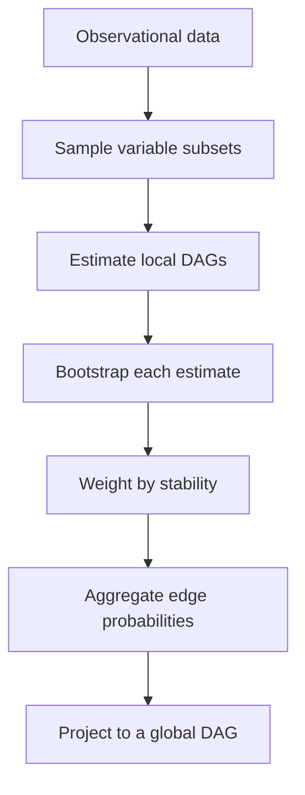
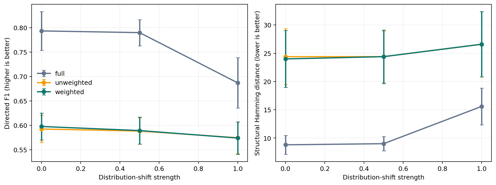

# CausalConsensus

**Stability-weighted subgraph aggregation for causal discovery under distribution shift.**

CausalConsensus asks a narrow research question: when a large causal graph must be reconstructed from many noisy local estimates, can bootstrap stability tell us which estimates deserve more influence?

The repository is an executable research package, not a claim of a finished scientific result. It includes a formal estimator, a synthetic structural-causal-model generator, controlled distribution shifts, baselines, uncertainty and calibration metrics, automated tests, a reproducible experiment runner, and a manuscript draft.

## Method in one picture



For local estimate \(A^{(k)}\), let \(d_k\) denote its normalized bootstrap disagreement. Its reliability weight is

\[
w_k=\exp(-\lambda d_k).
\]

For an edge \(i\to j\), the aggregated probability is

\[
\widehat p_{ij}=
\frac{\sum_{k:\{i,j\}\subseteq S_k}w_k\widehat p_{ij}^{(k)}}
{\sum_{k:\{i,j\}\subseteq S_k}w_k}.
\]

Candidate edges are inserted in descending confidence order while rejecting cycles. The exact maximum-weight acyclic-subgraph problem is NP-hard; the implementation therefore labels its deterministic DAG projection as a greedy approximation.

## Why this is testable

The central hypothesis is not assumed to be true:

> Local estimates that remain stable under bootstrap resampling have lower edge-error rates, so reliability weighting improves global reconstruction under limited samples and distribution shift.

The benchmark compares:

1. stability-weighted subgraph aggregation;
2. unweighted subgraph aggregation;
3. one full-data ordered-regression estimator.

It varies graph size, sample size, nonlinear mechanisms, Gaussian/Laplace/Student-t noise, mechanism shift, latent confounding, and missingness. Evaluation includes directed precision, recall, F1, structural Hamming distance, Brier score, expected calibration error, pair coverage, runtime, and memory.

## Current preliminary benchmark

The code was validated with a 45-row benchmark: five seeds, three shift strengths, three methods, 80 local subsets, and 30 bootstrap replicates per subset. These values are diagnostic, not paper results.

| Method | Mean directed F1 ↑ | Mean SHD ↓ | Mean Brier ↓ |
|---|---:|---:|---:|
| Full-data ordered regression | 0.757 | 11.13 | 0.0293 |
| Unweighted subgraphs | 0.585 | 25.13 | 0.0473 |
| Stability-weighted subgraphs | 0.587 | 25.00 | 0.0472 |

The first run provides modest support for weighting over equal voting, while also showing that subgraph aggregation does not yet beat the full-data baseline. The next experiments must determine when scaling, missing variables, or model misspecification reverse that ordering.



## Quick start

```bash
git clone https://github.com/Jonathan-Landmann/CausalConsensus.git
cd CausalConsensus
python -m pip install -e ".[experiments,dev]"
python -m pytest -q
python -m causal_consensus.cli demo --nodes 20 --samples 500 --shift 0.5
python -m causal_consensus.cli benchmark --quick --output results/quick
```

Run the fuller default benchmark by omitting `--quick`.

## Repository map

```text
src/causal_consensus/
  aggregation.py    weighted edge probabilities and uncertainty
  bootstrap.py      resampling, stability, pair-aware subset sampling
  discovery.py      transparent ordered-regression base estimator
  graph.py          DAG validation, sampling, and greedy projection
  metrics.py        graph recovery and calibration metrics
  pipeline.py       end-to-end experiment orchestration
  scm.py            synthetic mechanisms and distribution shifts
  experiments.py    multi-seed benchmarks and figures
paper/
  manuscript.tex    paper-style draft and experiment plan
  theory.md         finite-sample voting bound and assumptions
tests/              deterministic unit and integration tests
```

## Scope and limitations

- The current local estimator assumes a known or hypothesized causal ordering. This isolates aggregation behavior but does not solve unrestricted causal orientation.
- Bootstrap stability is a proxy for correctness, not proof of correctness. A consistently biased estimator can be stable and wrong.
- Latent confounding is simulated, but the present DAG output cannot represent bidirected edges.
- Greedy DAG projection is not guaranteed to find the globally optimal acyclic graph.
- Synthetic performance does not establish validity on scientific data.
- The smoke benchmark is too small for publication claims.

These limitations define the research agenda: replace the base learner with PC/GES/NOTEARS adapters, calibrate stability against edge correctness, add exact projection for small graphs, preregister the full benchmark, and test real causal datasets.

## Relationship to prior work

The project is motivated by the broader sample-estimate-aggregate approach to scalable causal discovery, but it explores a different primary object: a transparent stability-weighted estimator with an analyzable voting rule rather than a learned neural aggregator.

- Wu, Bao, Barzilay, and Jaakkola, [*Sample, estimate, aggregate: A recipe for causal discovery foundation models*](https://arxiv.org/abs/2402.01929), TMLR 2025.
- Meinshausen and Bühlmann, *Stability Selection*, JRSS B 2010.
- Zheng et al., *DAGs with NO TEARS*, NeurIPS 2018.

## Research integrity

Every reported number should be produced by a committed configuration and seed. Negative results belong in the repository. This software is research code and must not be used to infer real-world causal relationships without domain assumptions, sensitivity analysis, and external validation.

## License

MIT
